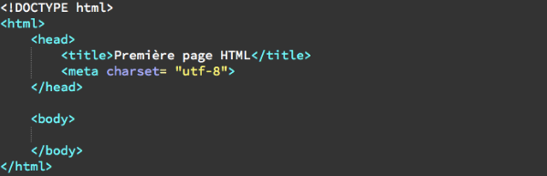
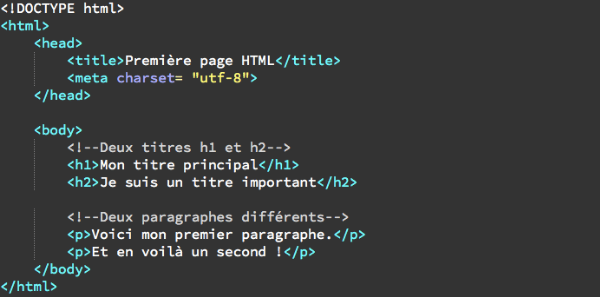
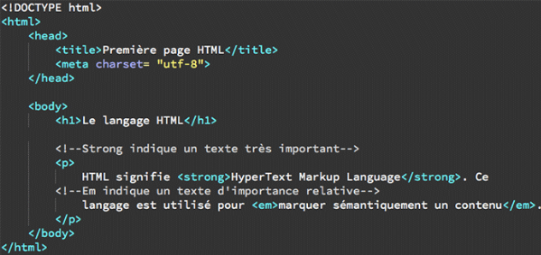
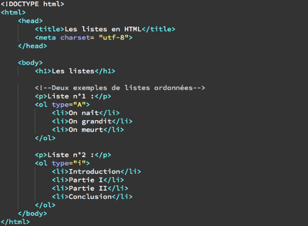

# Les bases de HTML5 et CSS3 !

Les langages HTML et CSS sont à la base de tout projet de développement web. En effet, les navigateurs vont utiliser ces deux langages pour afficher des pages web. En bref, pour créer un site e-commerce, un blog ou encore une application mobile, il est nécessaire de passer par du code en HTML ou CSS.  

*   HTML est l’abréviation de HyperText Markup langage, soit en français “langage de balisage hypertexte”. Grâce à cela, on va pouvoir indiquer au navigateur si le texte fait partie d’un paragraphe, d’un titre, … Il va aussi permettre d’insérer différents types d’éléments dans les pages web: texte, liens, images, ...

*   CSS est l’abréviation de Cascading StyleSheets, ou feuilles de style en cascade. Ce langage va permettre de définir la taille, la couleur et l’alignement d’un texte.

Il est donc très clair que l’utilisation de l’un ne va pas sans l’autre. Pour le développement d’un site, on fera donc des liens entre ces deux langages. Par exemple, l’utilisation du CSS sur un code HTML servira à améliorer le résultat visuel final.

Pourquoi apprendre le HTML et le CSS ?

C’est avant tout pour se créer un socle indispensable pour comprendre comment fonctionne son site et ainsi pouvoir le modifier ou corriger si besoin.

Nous nous concentrerons sur les versions HTML5 et CSS3 qui sont les dernières versions stables en date de ces deux langages.

## Les bases en HTML5

### Quelques définitions et utilité des éléments, des balises et des attributs:

*   **Eléments:**  
    Les éléments HTML servent à structurer le contenu pour lui donner un sens. Par exemple, on utilise des éléments pour définir un paragraphe, un titre, insérer une image ou une vidéo dans un document.

*   **Balises:**  
    Un élément HTML est constitué dans la majorité des cas d’une paire de balise et d’un contenu. Mais il peut aussi être constitué d’une balise unique qu’on dit alors orpheline.  
    Exemple pour écrire un paragraphe: `<p> Je suis un paragraphe HTML </p>`. Pour faire un retour à la ligne, on utilise l’élément `<br />` qui est une balise orpheline.

*   **Attributs:**  
    La balise ouvrante d’un élément HTML peut contenir des attributs, parfois même obligatoire. Ils servent à définir ou compléter un élément. Un attribut contient toujours une valeur.  
    Exemple: l’élément a (pour “anchor”) servant à créer des liens vers d’autres pages a besoin d’un attribut href (“hypertexte reference”) qui va prendre comme valeur l’adresse de la page vers laquelle on souhaite faire un lien.  
    `<a href=”https://www.imt-atlantique.fr/fr”> Mon site </a>`

Attention: Les balises et les attributs ne seront jamais affichés par le navigateur. Ils servent à indiquer au navigateur comment il doit traiter chaque contenu.

### Structure d’une page HTML:

Voici le code minimum pour une telle page avec un titre, un en-tête et un corps.



Le doctype du document sert à préciser le type du document. Les balises `<html>` et `</html>` représentent la page html. L’élément head va contenir des méta-informations relatives à la page comme le type d’encodage et l’élément body va contenir tout le contenu visible de la page. Il y a deux renseignements à indiquer à l’intérieur de l’élément head: l’élément `<title>` qui va contenir le titre de la page et son attribut `<charset>` qui va permettre de définir l’encodage de la page.

Il faut bien veiller à ce que le premier élément déclaré soit le dernier refermé, tandis que le premier ouvert doit toujours être le premier fermé. Il est vivement conseillé de bien indenter son code et de mettre des commentaires comme suit: `<!-- mon commentaire -- >`.

### Les titres et paragraphes:

Il y a 6 niveaux d’organisation pour les titres définis par les éléments h1, h2, h3, h4, h5 et h6\. h1 étant le titre principal et h6 le titre le plus petit.  
Pour ajouter un titre dans une page html, c’est très simple il suffit d’utiliser les balises comme par exemple: 

`<h3> Mon titre </h3>`

Attention: Ne pas confondre les éléments h1, h2, etc. et l'élément title, qui sont complètement différents. Les éléments h1, h2, etc servent à définir des titres à l’intérieur de la page, tandis que l’élément title sert à définir le titre de la page, qui va s’afficher dans la barre haute de votre navigateur.

Pour créer des paragraphes, il faut utiliser l’élément p. On peut créer autant de paragraphes que l’on souhaite dans une page. A chaque paragraphe, il faut utiliser un nouvel élément p.

`<p> 1er paragraphe </p>`  
`<p> 2nd paragraphe </p>`

Voici un exemple utilisant des titres et paragraphes:



### Les espaces et retours à la ligne en html:

Les espaces “en trop” au sein d’un paragraphe ne seront jamais affichés visuellement. Pour effectuer des retours à la ligne ou marquer des espaces en HTML, il faudra utiliser des éléments. Retour à la ligne: élément br balise orpheline qui est à placer avant ce qu’on souhaite mettre à la ligne suivante. Remarque: On peut aussi utiliser l’élément hr qui est un retour ligne avec changement de thématique, c’est à dire qu’un “trait” sera tracée entre les deux lignes.

Gestion des espaces:  
L’élément pre sert à préformater un texte. C’est à dire qu’il va garder la même mise en forme que celui écrit à l’intérieur de la balise.  
`<pre> Le texte ici sera affiché tel qu’il a été écrit </pre>`

### Définir l’importance des textes:

L’élément strong sert à signifier qu’un contenu est très important (il va alors être affiché en gras) nous utiliserons ensuite CSS pour gérer le poids d’un texte.  
L’élément em sert à signifier que le contenu est “relativement” important (il va être affiché en italique).



### Les listes en HTML:

Les listes sont très utiles pour donner de la clarté et de l’ordre aux documents. Il existe plusieurs types de listes: les listes non-ordonnées, les listes ordonnées et les listes de définitions.

**Les listes non-ordonnées:**  
Elles servent à lister des éléments sans hiérarchie ni ordre logique. Pour créer un telle liste, nous avons besoin d’un élément u1 qui va représenter la liste en soi ainsi que d’éléments li représentant chaque élément de la liste. Visuellement des puces apparaissent automatiquement devant chaque élément d’une liste non-ordonnée.

Par exemple:

```html
<ul>  
    <li>Pomme</li> 
    <li>Vélo</li> 
    <li>Guitare</li> 
</ul>
```


**Les listes ordonnées:**  
Lorsqu’on souhaite une notion d’ordre ou de progression logique entre les éléments d’une liste. On va utiliser l’élément ol pour définir la liste en soi et à nouveau des éléments li pour les différents éléments de la liste.

Par exemple:

```html
<ol>  
    <li>Partie 1</li>
    <li>Partie 2</li>  
    <li>Partie 3</li>   
</ol>
```

_Nous pouvons faire le choix d’ajouter un attribut type dans l’élément ol.  
“I” correspond à des chiffres romain majuscule devant chaque éléments, “i” à des chiffres romain minuscules, “A” signifie que des lettres majuscules apparaîtront devant chaque élément de la liste et “a” des lettres minuscules._



**Les listes de définition:**  
Ces listes vont permettre de lister des termes et d’ajouter des définitions ou descriptions pour chacun de ces termes. Nous allons utiliser l’élément dl pour chaque élément à décrire puis l’élément dt pour chaque élément à décrire et enfin l’élément dd pour la définition/ description en soi.

Par exemple:

```html
<dl>  
    <dt>HTML</dt>  
    <dd>HTML signifie HyperText Markup Language.</dd> 
</dl>
```

Remarque: Il est tout à fait possible d’imbriquer plusieurs listes.

### Liens internes et externes en HTML:

Pour créer des liens en HTML, on va utiliser l’élément a accompagné de son attribut href qui va prendre comme valeur la cible du lien. Il y a deux types de liens: les liens permettant de se déplacer d’une page à une autre à travers un même site (liens internes) et les liens permettant de se rendre sur un autre site (lien externe). Dans les deux cas, c’est la valeur de l’attribut href qui va changer.

_Liens externes:_

On place tout d’abord le lien hypertexte entre deux balises de l’élément a. Pour la balise entrante, on place l’attribut href avec l’adresse du lien.

Par exemple:  
`<p> Cliquer sur <a href=”facebook.com”> ce lien </a> pour aller sur facebook. </p>` Ici le texte “ce lien” sera affiché en hypertexte et l’utilisateur pourra consulter facebook en cliquant dessus.

Attention: Il faut que l’attribut href prenne une URL complète en valeur (adresse absolue).

_Liens internes:_

Ici même principe, mais l’attribut va prendre comme valeur, une adresse relative à l’adresse de départ. C’est à dire celle à partir de laquelle on fait notre lien.  
Un site n’est qu’un ensemble de fichiers liés entre eux. Il faut alors distinguer trois cas: la cas où la page de départ et celle d’arrivée sont dans le même dossier; le cas où la page destination est dans un sous-dossier par rapport à la page de départ et le cas où la page de destination est un dossier parent par rapport à la page de départ.

Exemple pour chacun des cas:  
Fichier dans un même dossier: 
`<p> Cliquer <a href=”fichier_meme_dossier.html”> ici</a> </p>` 
Fichier dans un dossier parent: 
`<p> Cliquer <a href=”../fichier-parent.html”> ici </a> </p>` 
Fichier dans un sous-dossier de nom “sous”: 
`<p> Cliquer <a href=”sous/fichier-sous.html”> ici </a> </p>`

L’attribut target: Cet attribut va permettre de choisir où doit s’ouvrir notre page de destination. En pratique, nous utiliserons souvent la valeur “_blank” qui spécifie qui spécifie que la nouvelle page doit s’ouvrir dans un nouvel onglet.

Par exemple: `<p> Vers <a href=”http://wikipedia.org” target=”_blank”> Wikipédia </a> </p>`

_Remarque:_  
-On peut aussi permettre l’envoi d’un mail, lorsqu’un visiteur va cliquer sur le lien, sa messagerie par défaut va automatiquement s’ouvrir:
`<p> M’envoyer <a href=”mailto: louis.somme@imt-atlantique.net”> un mail </a> </p>` 

### Insérer des images en HTML:

Chaque format d’image (JPG, PNG, GIF ou BITMAP) possède ses propres spécificités. Il faut donc bien faire attention au format lorsqu’on enregistre une image. Généralement on utilisera le format JPG.  
L’insertion d’image dans une page HTML va se faire au moyen de l’élément img. Cet élément est représenté par une balise orpheline. De plus, on va utiliser les attributs src et alt. L’attribut src va prendre comme valeur l’adresse de l’image tandis que l’attribut alt va contenir un texte décrivant l’image. Ce texte ne va être affiché QUE si l’image n’a pas pu l’être pour une raison ou pour une autre.  
L’image sera affichée en taille originale.

Exemple:  

``

Il est également possible d’afficher une image provenant d’un autre site en entrant l’adresse absolue du site en question dans le src.
